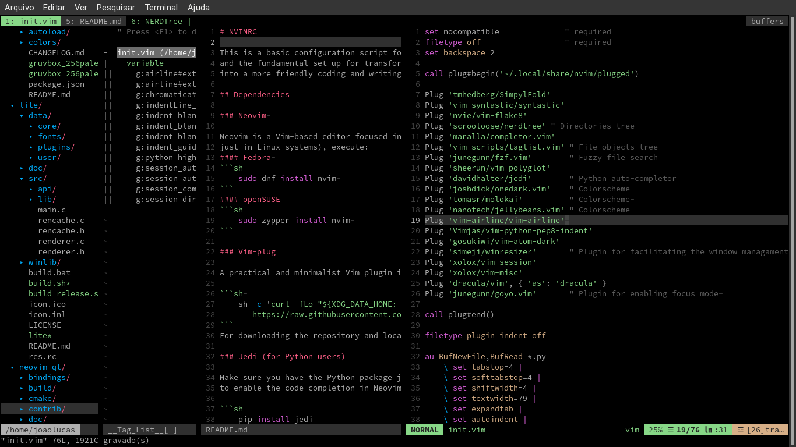

# NVIMRC

This is a basic configuration script for Neovim.  It contains plugins suggestions
and the fundamental set up for transforming the factory settings editor
into a more friendly coding and writing environment.

## Dependencies

### Neovim 

Neovim is a Vim-based editor focused in extensibility. For installing it (tested
just in Linux systems), execute: 
#### Fedora 
```sh 
    sudo dnf install nvim 
```
#### openSUSE
```sh
    sudo zypper install nvim 
```

### Vim-plug

A practical and minimalist Vim plugin installer. For intalling it (Unix and Linux), just execute:

```sh 
    sh -c 'curl -fLo "${XDG_DATA_HOME:-$HOME/.local/share}"/nvim/site/autoload/plug.vim --create-dirs \
       https://raw.githubusercontent.com/junegunn/vim-plug/master/plug.vim'
```
For downloading the repository and locating it in the proper directory.

### Jedi (for Python users)

Make sure you have the Python package jedi installed in the virtual environment you are using in order
to enable the code completion in Neovim. 

```sh
    pip install jedi
```

## Installation 

Clone this repository and go to the directory nvimrc. Next, copy the script
init.vim to the proper path in your system in order to make it visible to Neovim:

```sh
    cp init.vim ~/.config/nvim/ 
```
Now, open Neovim and execute the command :PlugInstall, in order to install all the plugins
described in init.vim. And it is done. 

## Screenshot 




